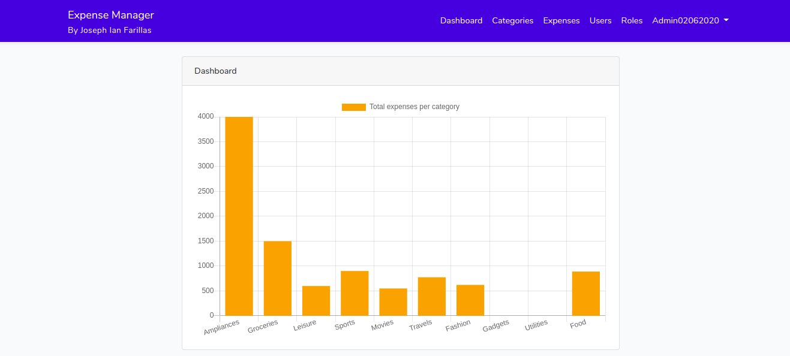

# Expense Manager
A web portal for tracking expenses by Joseph Ian Farillas

## Installation
1. Git clone the project:
```
git clone https://github.com/jfarillas/expense-manager.git
```

2. Option A
- Using Composer to install ```vendor``` dependencies:
```
composer install
composer dump-autoload
```
- Run DB migration script
```
php artisan migrate
```
- Run DB seeder script (For role permissions)
```
php artisan db:seed --class=PermissionTableSeeder
```

Option B. Using Docker
- Using Docker Machine 
```
docker-machine create --driver virtualbox dev
```
- Docker Compose
```
docker-compose up --build api
```

- Docker Compose (Run in the background)
```
docker-compose up --build -d api
```

3. Navigate ```api/resources/js/```. Using NPM to install ```node_modules``` dependencies:
```
npm install
```

4. Go to the browser and type ``` http://127.0.0.1 ``` or ``` http://192.168.99.100 ``` if you are using Docker.


